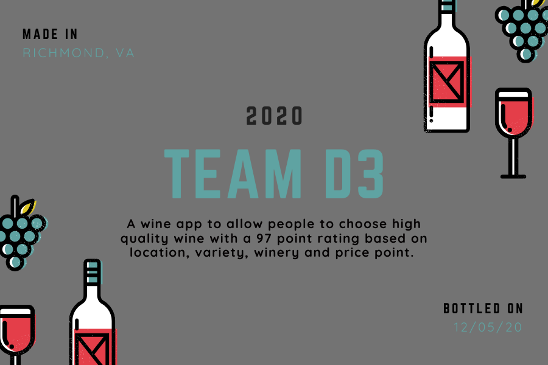
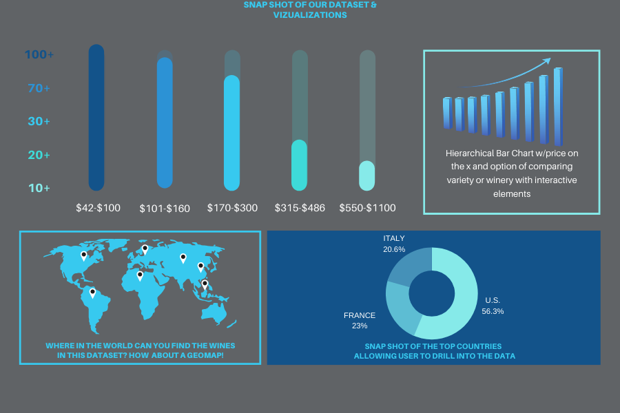

# D3_Team_Project2_Proposal
Team project with Analysts Arica Jackson, L.I. Villaranda, Jonas Bronhome, Morgan McM and Nic Pittman. Using ETL, Javascript, HTML, and interactive elements to analyze and display data.
<!--  -->

### The Why

* It's been said "Life is too short to drink bad wine" but what if a site starts out with good wine and allows people to curate their own wine experience based on their desire of location, variety, winery and price? Good wine would no longer be out of reach by price. Additionally, what if you want to plan a winery tour but you don't have the time to suffer through bad wine. By focusing on one wine rating of 97 points based on wine reviews from all over the world this app takes the veil off of where to find great wine whether you want to spend $40 or $1100. Whether you want to stay within the U.S.A. or order from or travel to Australia! It puts the power in peoples hands and allows them to get the most bang for their buck in the following ways:

  *Getting the most value for their money at this price point.
  *Making the most of their winery tour by planning it around 97 point wines 
  *Try different varieties of wine but ensuring consistency of rating and quality to allow you to really filter out what kind of wine you truly like
  *Ability to visualize what provinces/states have the highest concentration of 97 point wines at their wineries
  
### The roles
  #### Back End Web Development - Morgan McCown
        
  * Creation of Jupyter Notebook to perform ETL and allow us to dissect data (this can be found on our repo morgan already started) 
    it also has a snapshot of the original dataset)
  
  * Creating a database that joins transformed data and lat and long data that Viz Specialist L.I. is gathering. 
  
  * Creation of database a SQL or MongoDB that new app will link to

  #### Visualization Team 
  
  * Jonas Bonhomme - using dash plot and dataviz to create interactive pie visualizations to allow users to drill into the dataset by country and price.
  
  * L.I. Villaranda - creation of geomap to plot each wine in the data set and use interactive elements to visualize what provinces/states have higher clusters of 97 point wine     at their wineries.
  
  * Nic Pittman - creating an interactive bar chart to allow users to visualize (option 1) variety or (option 2) winery on the y axis and price on the x axis.
   
  #### Front End Web Development - Arica Jackson

  * Proposal/Readme/Slides
  
  * Create index.html, creation of landing page where we can see a comparison of all of the plots and another page where we can view the data used to build them The Viz team   will create individual pages for each plot and a means by which we can navigate between them. Their pages will contain 
    the vizualiations and their corresponding explanations that answer the italicized items above in the Why section. quest a landing page where we can see a comparison of all of the plots, and another page where we can view the data used to build them.

   

  

