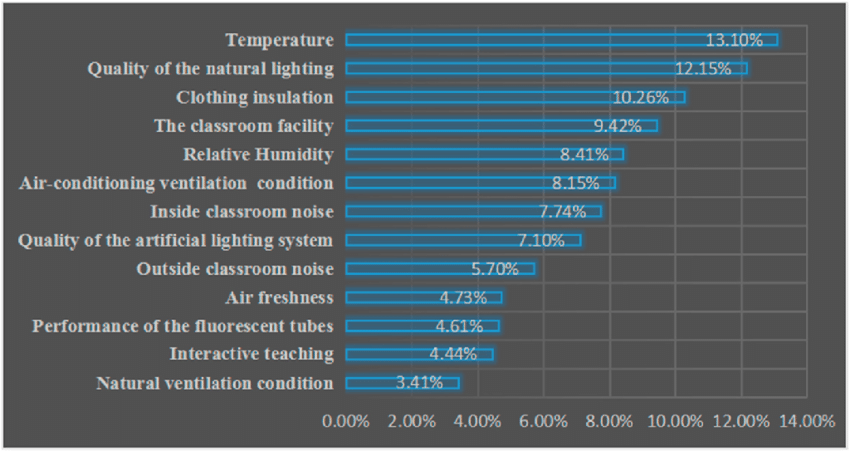
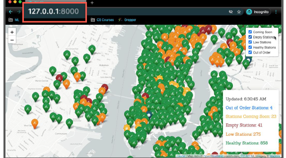
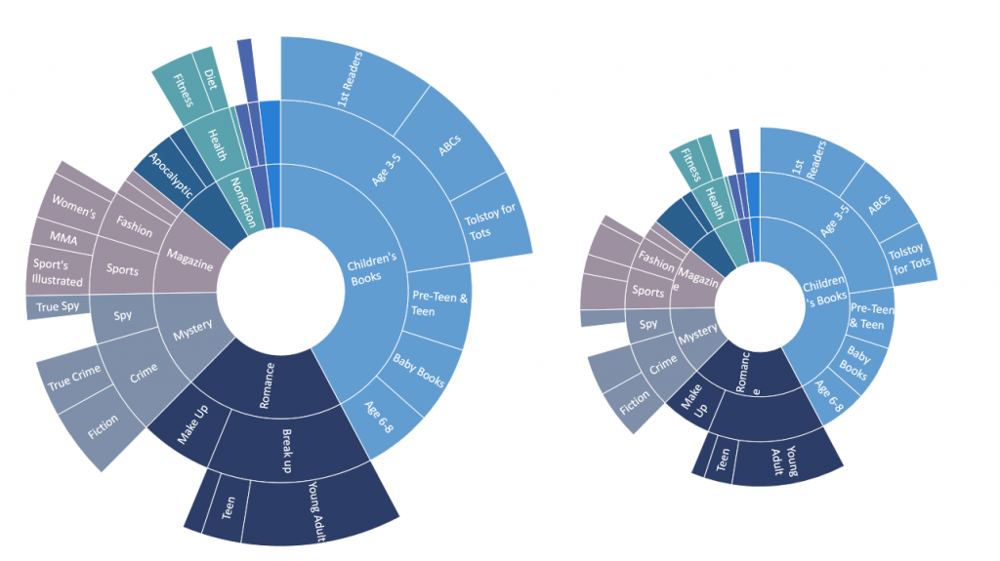

# D3_Team_Project2_Proposal
Using ETL, Javascript, HTML, and interactive elements to analyze and display data.

### The Why

* It's been said "Life is too short to drink bad wine" but what if a site starts out with good wine and allows people to curate their own wine experience based on their desire of location, variety, winery and price? Good wine would no longer be out of reach by price. Additionally, what if you want to plan a winery tour but you don't have the time to suffer through bad wine. By focusing on one wine rating of 97 points based on wine reviews from all over the world this app takes the veil off of where to find great wine whether you want to spend $40 or $1100. Whether you want to stay within the U.S.A. or order from or travel to Australia! It puts the power in peoples hands and allows them to get the most bang for their buck in the following ways:

  **Getting the most value for their money at their desired price point.
  
  **Making the most of their winery tour by planning it around wineries with high quality wine.
  
  **Allow user to try different varieties of wine but by ensuring consistency of rating and quality allow user to really filter out what kind of wine they enjoy
  
  **Ability to visualize what provinces/states have the highest concentration of 97 point wines at their wineries
  
  
### The roles
  #### Back End Web Development - Morgan McCown
        
  * Creation of Jupyter Notebook to perform ETL and allow us to dissect data 
  
    [Wine_Data_Beginning_Analysis.ipynb](Wine_Data_Beginning_Analysis.ipynb) 
  
  * Creating a database that joins transformed data and lat and long data that Viz Specialist L.I. is gathering. 
  
  * Creation of database a SQL or MongoDB that new app will link to

  #### Visualization Team - this team will create individual pages for each of their visualizations and a means to navigate between - Jonas, L.I., Nic
  
  * Jonas Bonhomme - using dash plot and dataviz to create interactive pie visualizations to allow users to drill into the dataset by country and     price.
  
  * L.I. Villaranda - creation of geomap to plot each wine in the data set and use interactive elements to visualize what provinces/states have higher clusters of 97 point wine     at their wineries.
  
  * Nic Pittman - creating an interactive bar chart to allow users to visualize (option 1) variety or (option 2) winery on the y axis and price on the x axis.
   
  #### Front End Web Development - Arica Jackson

  * Proposal/Readme/Slides
  
  * Creation of landing page where we can see a summary of the data and a comparison of all of the visuals. And another page where we can view the data used to build them.
  
## Conclusion
 
 * We are building a visualization dashboard website with multiple interactive visuals that update from the same data using the following data set. This data will be               transformed further, as the data viz team is adding lat and long in order to complete the geomap.  [cleaned_data.csv](cleaned_data.csv)             

 * Our original data set was over 130,000 records. The data set below contains over 180 records. The data viz team is adding lat and long to this data set.
 * Our final transformed data will consist of more than the required 100 records and each of the three visuals will contain user-driven interaction.
 * Please see below some of our inspirations. We like the 'web challenge' dashboard model and plan to apply our data to that format. For example instead of Latitude (Home) and 
  instead of plots (Visuals) with a drop down of the subject that particular visual analyzes. For example location, variety and wineries, price and country, etc.          
 
     

    

